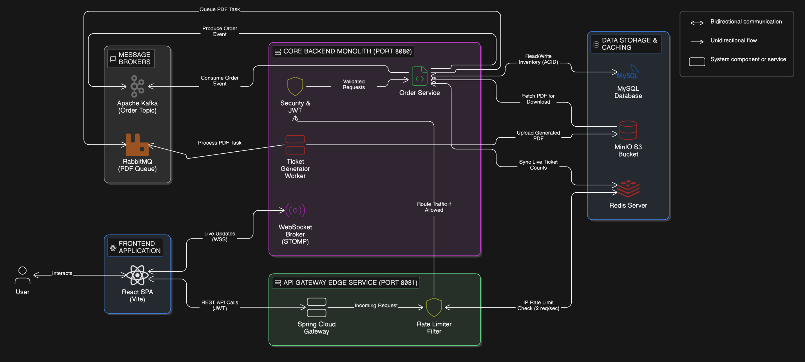

# 🎟️ FlashTix Live

### ⚡ Real-Time Ticketing Platform 

<p align="center">
  <em>High-performance distributed system designed for extreme flash-sale traffic</em>
</p>

---

## 🚀 Overview

FlashTix is a **scalable, event-driven ticketing platform** built to handle **massive concurrent users during flash sales**.

It ensures:

- ⚡ Instant response (non-blocking APIs)
- 🔒 Zero data loss
- 🌐 Real-time updates across all clients
- 🛡️ Stability under heavy traffic

---

## ✨ Core Features

- 🚪 API Gateway with Redis-based Rate Limiting
- 🧠 Event-Driven Architecture (Apache Kafka)
- ⚡ Real-Time Updates using WebSockets (STOMP + SockJS)
- 🔄 Asynchronous Order Processing
- 🛡️ Fault Tolerance with Circuit Breaker (Resilience4j)
- 📄 Background PDF Ticket Generation (RabbitMQ)
- 📦 Object Storage with MinIO

---

## 🏗️ System Architecture

<p align="center">
  
  <br/>
  <em>End-to-end distributed flow of FlashTix system</em>
</p>

---

## 🔄 End-to-End Request Flow

1. User clicks **Buy Ticket** on frontend
2. Request goes to **API Gateway**
3. Gateway applies **rate limiting (Redis)**
4. Request forwarded to backend service
5. Order published to **Kafka topic**
6. Consumer processes order asynchronously
7. Inventory updated in **MySQL (transaction-safe)**
8. Redis cache updated
9. WebSocket broadcasts live ticket count
10. RabbitMQ triggers PDF generation
11. PDF stored in **MinIO**
12. User downloads ticket from dashboard

---

## 🧰 Tech Stack

### ⚙️ Backend

- Java 17+
- Spring Boot 3
- Spring Security + JWT
- Spring Data JPA / Hibernate
- Resilience4j

### 🚪 API Gateway

- Spring Cloud Gateway
- Reactive Redis (Rate Limiting)

### 🧱 Infrastructure

- MySQL (Relational DB)
- Redis (Cache + Rate Limiting)
- Apache Kafka (Event Streaming)
- RabbitMQ (Background Jobs)
- MinIO (Object Storage)

### 🎨 Frontend

- React + Vite
- Axios (JWT interceptors)
- STOMP.js + SockJS

---

## ⚙️ Local Setup

### 1️⃣ Clone Repository

```bash
git clone https://github.com/YOUR_USERNAME/FlashTix-Live.git
cd FlashTix-Live
```

---

### 2️⃣ Start Infrastructure (Docker Recommended)

- docker run -d -p 6379:6379 redis
- docker run -d -p 3306:3306 -e MYSQL_ROOT_PASSWORD=root mysql

- (Also start Kafka, RabbitMQ, and MinIO as per your setup)

### 3️⃣ Start API Gateway

- cd flashtix-gateway
- ./mvnw spring-boot:run

### 4️⃣ Start Backend Services

- cd flashtix-backend
- ./mvnw spring-boot:run

### 5️⃣ Start Frontend

- cd flashtix-frontend
- npm install
- npm run dev

---

### 📡 API Endpoints

### 🔐 Authentication

- POST /api/auth/register
- POST /api/auth/login
- POST /api/auth/refresh

### 🎤 Events

- GET /api/events
- POST /api/events (Admin only)

### 🎟️ Orders & Tickets

- POST /api/orders/purchase
- GET /api/orders/my-tickets
- GET /api/orders/{orderId}/download

### 🛡️ Rate Limiting (Gateway)

- Implemented using Redis + Spring Cloud Gateway
- Based on client IP address
- Prevents system overload during flash sales
- Protects Kafka, DB, and backend services

### 🧠 Engineering Concepts Used

- API Gateway Pattern
- Rate Limiting (Token Bucket Algorithm)
- Event-Driven Architecture
- Circuit Breaker Pattern
- Distributed Caching
- Asynchronous Processing
- Microservices Design

---

### 📈 Future Enhancements

### 💳 Payment Gateway Integration (Stripe/Razorpay)

### 🔐 OAuth2 / Keycloak Authentication

### 📊 Monitoring (Prometheus + Grafana)

### ☸️ Kubernetes Deployment

### 🤖 Bot Protection & Rate Intelligence
